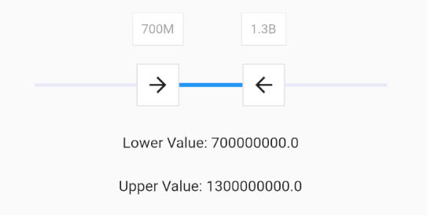

# flutter_xlider

(Flutter Xlider) A material design slider and range slider, horizontal and vertical, with rtl support and lots of options and customizations for flutter

**Version 2.3.0 and above, will break functionality of older versions**

## Get Started

### Single Slider

A single slider

```dart
FlutterSlider(
  values: [300],
  max: 500,
  min: 0,
  onDragging: (handlerIndex, lowerValue, upperValue) {
    _lowerValue = lowerValue;
    _upperValue = upperValue;
    setState(() {});
  },
)
```


to make slider `Right To Left` use `rtl: true`

```dart
 FlutterSlider(
  ...
  rtl: true,
  ...
)
```


### Range Slider

A simple example of range slider

```dart
FlutterSlider(
  values: [30, 420],
  rangeSlider: true,
  max: 500,
  min: 0,
  onDragging: (handlerIndex, lowerValue, upperValue) {
    _lowerValue = lowerValue;
    _upperValue = upperValue;
    setState(() {});
  },
)
```


### Vertical Axis

You can change the axis of your slider by setting `axis` to `Axis.vertical`. Default is horizontal
```dart
FlutterSlider(
  ...
  axis: Axis.vertical,
  ...
)
```

 


## Handlers

You can customize handlers using `handler` and `rightHandler` properties.  
Both `handler` and `rightHandler` accept `FlutterSliderHandler` class which has `icon`, `child` and `disabled` properties  

1. `icon` is used to only change and customize the icon of handlers.
2. `child` is a widget, if you pass a widget to it, the `icon` property will be ignored
3. `disabled` to disable the handler

```dart
FlutterSlider(
  ...
  handler: FlutterSliderHandler(
    child: Material(
      type: MaterialType.canvas,
      color: Colors.orange,
      elevation: 3,
      child: Container(
          padding: EdgeInsets.all(5),
          child: Icon(Icons.adjust, size: 25,)),
    ),
  ),
  rightHandler: FlutterSliderHandler(
    icon: Icon(Icons.chevron_left, color: Colors.red, size: 24,),
  ),
  ...
)
```


### Handler Scale Animation

You can control the scale animation type of your handlers, it's duration and it's scale size using `handlerAnimation`    
`handlerAnimation` accepts a `FlutterSliderHandlerAnimation` class which has 4 properties as following

```dart
FlutterSlider(
  ...
    handlerAnimation: FlutterSliderHandlerAnimation(
      curve: Curves.elasticOut,
      reverseCurve: Curves.bounceIn,
      duration: Duration(milliseconds: 500),
      scale: 1.5
    ),
  ...
)
```


**if you don't want scale animation, then just pass `1` to `scale` property**  
**if you don't want `reverseCurve`, just ignore it. default is null**


## Trackbars

to customize track bars you can use `FlutterSliderTrackBar`. [You can see the details here](https://pub.dartlang.org/documentation/flutter_xlider/latest/flutter_xlider/FlutterSliderTrackBar/FlutterSliderTrackBar.html)

```dart
FlutterSlider(
  ...
    trackBar: FlutterSliderTrackBar(
      activeTrackBarColor: Colors.redAccent,
      activeTrackBarHeight: 5,
      leftInactiveTrackBarColor: Colors.greenAccent.withOpacity(0.5),
    ),
  ...
)
```

## Tooltips

in order to customize your tooltips, you can use `FlutterSliderTooltip` class. [You can see all properties here](https://pub.dartlang.org/documentation/flutter_xlider/latest/flutter_xlider/FlutterSliderTooltip/FlutterSliderTooltip.html)

```dart
FlutterSlider(
  ...
  tooltip: FlutterSliderTooltip(
    textStyle: TextStyle(fontSize: 17, color: Colors.white),
    boxStyle: FlutterSliderTooltipBox(
      decoration: BoxDecoration(
        color: Colors.redAccent.withOpacity(0.7)
      )
    )
  ),
  ...
)
```

Here there is a range slider with customized handlers, trackbars and tooltips


### Tooltip Prefix

You can use `leftPrefix`, `leftSuffix`, `rightPrefix`, `rightSuffix` to add your desired widget around tooltip content.

```dart
FlutterSlider(
  ...
    tooltip: FlutterSliderTooltip(
      leftPrefix: Icon(Icons.attach_money, size: 19, color: Colors.black45,),
      rightSuffix: Icon(Icons.attach_money, size: 19, color: Colors.black45,),
    ),
  ...
)
```


### Tooltip Number Format

you can customize tooltip numbers by using `NumberFormat` class  
here is an example  

```dart
FlutterSlider(
  ...
    tooltip: FlutterSliderTooltip(
      numberFormat: intl.compact(),
      // numberFormat: intl.NumberFormat(),
    ),
  ...
)
```
you can find more about [NumberFormat](https://docs.flutter.io/flutter/intl/NumberFormat-class.html)




### Disable tooltip

To disable tooltips, use `disabled` in `FlutterSliderTooltip` class
```dart
FlutterSlider(
  ...
    tooltip: FlutterSliderTooltip(
      disabled: true,
    ),
  ...
)
```


### Always Show Tooltips

tooltips always displayed if this property is set to `true`.

```dart
FlutterSlider(
  ...
  tooltip: FlutterSliderTooltip(
    alwaysShowTooltip: true,
  ),
  ...
)
```


## Controls

### Handlers width and height

By default both handlers size are 35 width and height, but you can change this by `handlerWidth` and `handlerHeight`

```dart
FlutterSlider(
  ...
  handlerWidth: 30,
  handlerHeight: 30,
  ...
)
```

**Whether you make new widget by `handler` or `rightHandler` and set their width and height explicitly,
but `handlerWidth` and `handlerHeight` are the main size for measuring handlers movement**

### Select By Tap

You can tap on the slider to select it's value.  
if slider is range-slider, then the closest handler to the selected point will move to that point

```dart
FlutterSlider(
  ...
  selectByTap: true, // default is true
  ...
)
```


### Jump

by default slider handlers move fluently, if you set `jump` to true, handlers will jump between intervals

```dart
FlutterSlider(
  ...
  jump: true,
  ...
)
```

### Step

The amount the slider changes on movement can be set using `step` option

```dart
FlutterSlider(
  ...
  step: 100,
  ...
)
```

### Ignore Steps

if your configurations requires that some steps are not available, you can use `ignoreSteps` property.  
this property accepts a simple class to define `from` and `to` ranges.

```dart
FlutterSlider(
  ...
    ignoreSteps: [
      FlutterSliderIgnoreSteps(from: 8000, to: 12000),
      FlutterSliderIgnoreSteps(from: 18000, to: 22000),
    ],
  ...
)
```


### Minimum Distance

when using range slider, the minimum distance between two handlers can be defined using `minimumDistance` option

```dart
FlutterSlider(
  ...
    minimumDistance: 300,
  ...
)
```


### Maximum Distance

this is the opposite of minimum distance, when using range slider, the maximum distance between two handlers can be defined using `maximumDistance` option

```dart
FlutterSlider(
  ...
    maximumDistance: 300,
  ...
)
```


### ~~Touch Zone~~

~~You can control how big a handler's touch area could be. by default touch zone is 2  
the range is between 1 to 5~~


### Touch Size

You can control how big a handler's touch area could be. by default touch size is 25
The range is between 10 to 100

```dart
FlutterSlider(
  ...
  touchSize: 25,
  ...
)
```

To see the touchable area for handlers you set `displayTestTouchZone` to true and test your slider


```dart
FlutterSlider(
  ...
  displayTestTouchZone: true,
  ...
)
```


### Disabled

to disable your slider, you can use `disabled`. 

```dart
FlutterSlider(
  ...
  disabled: true,
  ...
)
```

### RTL

makes the slider `Right To Left`

```dart
FlutterSlider(
  ...
  rtl: true,
  ...
)
```

## Events

There are 3 events

`onDragStarted`: fires when drag starts  
`onDragCompleted` fires when drag ends  
`onDragging` keeps firing when dragging  

All three of above functions returns three values. 
```dart
(int handlerIndex, double lowerValue, double upperValue)
```

First value is `handlerIndex`, which determines the handler. 0 is `Left Handler` and 1 refers to `Right Handler`

```dart
FlutterSlider(
  ...
  onDragging: (handlerIndex, lowerValue, upperValue) {
    _lowerValue = lowerValue;
    _upperValue = upperValue;
    
    if(handlerIndex == 0)
        print(" Left handler ");
    
    setState(() {});
  },
  ...
)
```


